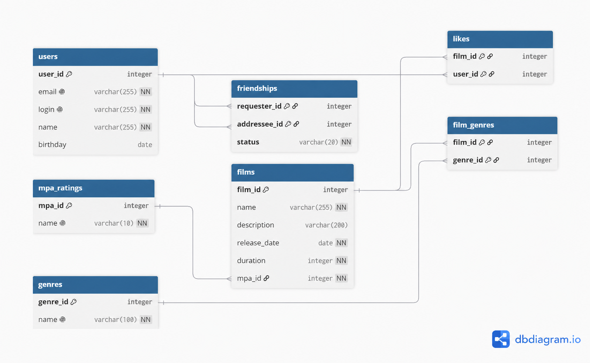

# java-filmorate

Сервис для работы с фильмами, оценками и списками друзей пользователей.

## Схема базы данных



Основные таблицы:

- `users` хранит данные пользователей;
- `films` хранит данные фильмов и ссылается на возрастной рейтинг из `mpa_ratings`;
- `genres` и `film_genres` реализуют связь «многие ко многим» между фильмами и жанрами;
- `likes` реализует связь «многие ко многим» между пользователями и понравившимися фильмами;
- `friendships` хранит направленное добавление одного пользователя в друзья к другому и статус этой связи.

Дружба не становится взаимной автоматически. Первая направленная запись получает статус `UNCONFIRMED`.
Если второй пользователь тоже добавит первого в друзья, появляется обратная запись, а обе связи получают статус
`CONFIRMED`. При удалении одной из встречных записей оставшаяся связь снова получает статус `UNCONFIRMED`.

В таблицах `film_genres`, `likes` и `friendships` используются составные первичные ключи. Они не позволяют повторно сохранить одну и ту же связь. Списки жанров, лайков и друзей вынесены в отдельные таблицы, поэтому каждое поле содержит одно значение, а неключевые поля зависят только от первичного ключа.

## Примеры SQL-запросов

Получение всех фильмов вместе с рейтингом MPA:

```sql
SELECT f.film_id,
       f.name,
       f.description,
       f.release_date,
       f.duration,
       m.name AS mpa
FROM films AS f
JOIN mpa_ratings AS m ON m.mpa_id = f.mpa_id
ORDER BY f.film_id;
```

Получение жанров выбранного фильма:

```sql
SELECT g.genre_id,
       g.name
FROM genres AS g
JOIN film_genres AS fg ON fg.genre_id = g.genre_id
WHERE fg.film_id = :film_id
ORDER BY g.genre_id;
```

Получение всех пользователей:

```sql
SELECT user_id,
       email,
       login,
       name,
       birthday
FROM users
ORDER BY user_id;
```

Получение топа наиболее популярных фильмов:

```sql
SELECT f.film_id,
       f.name,
       COUNT(l.user_id) AS likes_count
FROM films AS f
LEFT JOIN likes AS l ON l.film_id = f.film_id
GROUP BY f.film_id, f.name
ORDER BY likes_count DESC, f.film_id
LIMIT :limit;
```

Получение общих друзей двух пользователей:

```sql
SELECT u.user_id,
       u.email,
       u.login,
       u.name,
       u.birthday
FROM users AS u
JOIN friendships AS first_user
  ON first_user.addressee_id = u.user_id
 AND first_user.requester_id = :user_id
JOIN friendships AS second_user
  ON second_user.addressee_id = u.user_id
 AND second_user.requester_id = :other_user_id
ORDER BY u.user_id;
```
